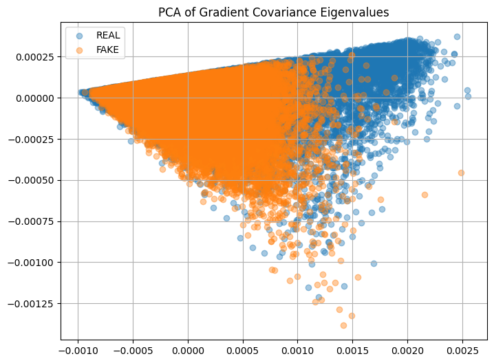
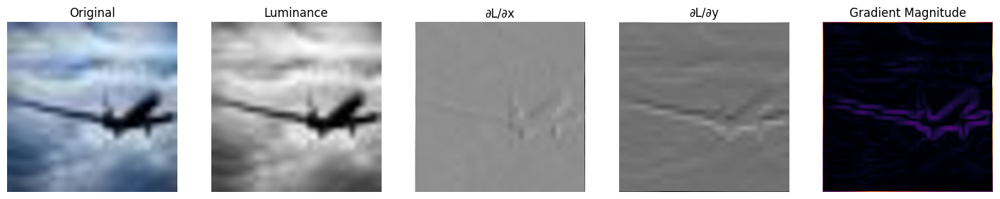

# Using Image Gradients to Detect Synthetic Images

## what this notebook answers:<br>
### *do the fine-scale changes in brightness across an image obey the physical constraints imposed by real cameras, or do they show statistical signatures of being reconstructed from noise?*
this project is intentionally designed as a **statistical and physics-based analysis**, not as a production-ready detector.

## install+import


```python
!pip install -q numpy matplotlib pillow torch torchvision tqdm scikit-learn
```


```python
import os
import random
import numpy as np
import torch #fast convolution, only used as math engine. used like a calculator
import torch.nn.functional as F
from PIL import Image
import matplotlib.pyplot as plt
from tqdm import tqdm
from sklearn.decomposition import PCA
```

## config


```python
DATASET_ROOT="/kaggle/input/cifake-real-and-ai-generated-synthetic-images"
SPLIT="train"
IMG_SIZE= 256
DEVICE = "cuda" if torch.cuda.is_available() else "cpu"

MAX_IMAGES_PER_CLASS = 50000
# control how many images to "train" on
#dataset is massive


print("Device:", DEVICE)
```

    Device: cuda
    

## image loader
here the image becomes a 3D array
$$
\text{img} \in \mathbb{R}^{H \times W \times 3}
$$
<br>
Where:<br>
H,W=height,width<br>
Channel 0 = Red<br>
Channel 1 = Green<br>
Channel 2 = Blue<br>
Pixel values are normalized to [0,1]

This matters because gradients depend on **relative intensity**, not raw byte values.


```python
def load_image(path, size=256):
    img = Image.open(path).convert("RGB")
    img = img.resize((size, size))
    img = np.asarray(img).astype(np.float32) / 255.0
    return img
```

## rgb -> luminance
mathematically rgb is a vector and luminance is a projection onto a single axis
$$
L(x,y) = \mathbf{w}^\top \mathbf{I}(x,y)
$$

where:

$$
\mathbf{w} = [0.2126,\ 0.7152,\ 0.0722]
$$
this removes color tricks and isolates **physical brightness**.


```python
def rgb_to_luminance(img):
    R, G, B = img[...,0], img[...,1], img[...,2]
    return 0.2126*R + 0.7152*G + 0.0722*B
```

## spatial gradients (∂L/∂x, ∂L/∂y)
*How much does brightness change if I move one pixel to the right?*


```python
def compute_gradients(L):
    L = torch.tensor(L, device=DEVICE).unsqueeze(0).unsqueeze(0)

    sobel_x = torch.tensor(
        [[[-1,0,1],[-2,0,2],[-1,0,1]]],
        device=DEVICE
    ).unsqueeze(0) / 8.0

    ## this is a finite difference approximation of a derivative
    ## mathematically it computes a weighted sum of nearby pixels and approximates ∂/∂x while smoothing noise
    
    sobel_y = torch.tensor(
        [[[-1,-2,-1],[0,0,0],[1,2,1]]],
        device=DEVICE
    ).unsqueeze(0) / 8.0

    Gx = F.conv2d(L, sobel_x, padding=1)
    Gy = F.conv2d(L, sobel_y, padding=1)

    return Gx.squeeze().cpu().numpy(), Gy.squeeze().cpu().numpy()
```

each pixel now has a horizontal gradient and a vertical gradient

## gradient vector field (v(x,y))
here, every pixel becomes a 2d vector. so the image is now a vector field;
$$
V = \{ \vec{v}_1, \vec{v}_2, \dots, \vec{v}_N \}
$$
where N=H*W
This is important as *we are no longer analyzing images, but fields of directional change.*


```python
def gradient_vectors(Gx, Gy):
    return np.stack([Gx.flatten(), Gy.flatten()], axis=1)
    # each row = one pixel’s gradient vector
```

## covariance matrix
here covariance measures how gradient components vary together


```python
def gradient_covariance(V):
    V = V - V.mean(axis=0, keepdims=True)
    return (V.T @ V) / V.shape[0]
```

## feature extraction


```python
def extract_features_and_intermediates(img):
    L = rgb_to_luminance(img)
    Gx, Gy = compute_gradients(L)
    V = gradient_vectors(Gx, Gy)
    C = gradient_covariance(V)
    eigvals = np.linalg.eigvalsh(C)

    return {
        "luminance": L,
        "Gx": Gx,
        "Gy": Gy,
        "magnitude": np.sqrt(Gx**2 + Gy**2),
        "covariance": C,
        "eigvals": eigvals
    }
```

## Why real cameras differ from AI
#### --> Real cameras:
- optical blur couples directions
- sensors impose correlations
- noise follows physical laws

#### --> Diffusion models:
- reconstruct images from noise
- gradients are statistically plausible
- but lack real optical constraints

#### This difference lives in C.

## What eigenvalues answer:
*"along which directions does gradient variation concentrate?"*<br>
Large eigenvalue -> dominant direction<br>
Small eigenvalue -> constrained direction
#### Real images:
often **anisotropic** (one dominant eigenvalue)
#### AI images:
more **isotropic** (balanced eigenvalues)

## load dataset
this function loads a controlled number of real and fake images, extracts their gradient–covariance eigenvalues, and stores them with labels so we can later analyze and visualize them


```python
def load_dataset(split):
    data = []

    for label, cls in enumerate(["REAL", "FAKE"]):
        folder = os.path.join(DATASET_ROOT, split, cls)
        files = os.listdir(folder)
        random.shuffle(files)
        files = files[:MAX_IMAGES_PER_CLASS]

        for f in tqdm(files, desc=f"{cls}"):
            path = os.path.join(folder, f)
            try:
                img = load_image(path, IMG_SIZE)
                out = extract_features_and_intermediates(img)
                data.append((out["eigvals"], label, path))
            except:
                continue

    return data

dataset = load_dataset(SPLIT)
```

    REAL: 100%|██████████| 50000/50000 [06:43<00:00, 123.76it/s]
    FAKE: 100%|██████████| 50000/50000 [06:49<00:00, 122.20it/s]
    

## pca visualisation

each image is now a point in feature space.<br>PCA to find directions of maximal variance and reveal clustering


```python
X = np.array([d[0] for d in dataset])
y = np.array([d[1] for d in dataset])

pca = PCA(n_components=2)
X_pca = pca.fit_transform(X)

plt.figure(figsize=(8,6))
plt.scatter(X_pca[y==0,0], X_pca[y==0,1], alpha=0.4, label="REAL")
plt.scatter(X_pca[y==1,0], X_pca[y==1,1], alpha=0.4, label="FAKE")
plt.legend()
plt.title("PCA of Gradient Covariance Eigenvalues")
plt.grid()
plt.show()
```


    

    


## pipeline viz
Original -> Luminance -> Gx -> Gy -> Magnitude


```python
def visualize_pipeline(path):
    img = load_image(path, IMG_SIZE)
    out = extract_features_and_intermediates(img)

    fig, axs = plt.subplots(1,5, figsize=(18,4))

    axs[0].imshow(img)
    axs[0].set_title("Original")

    axs[1].imshow(out["luminance"], cmap="gray")
    axs[1].set_title("Luminance")

    axs[2].imshow(out["Gx"], cmap="gray")
    axs[2].set_title("∂L/∂x")

    axs[3].imshow(out["Gy"], cmap="gray")
    axs[3].set_title("∂L/∂y")

    axs[4].imshow(out["magnitude"], cmap="inferno")
    axs[4].set_title("Gradient Magnitude")

    for ax in axs:
        ax.axis("off")

    plt.show()
```

## manual classification
this is a nearest-mean test<br>basically answers *"which statistical structure does this image resemble more?"*


```python
real_center = X[y==0].mean(axis=0)
fake_center = X[y==1].mean(axis=0)

def classify_image(path):
    img = load_image(path, IMG_SIZE)
    out = extract_features_and_intermediates(img)
    feat = out["eigvals"]

    d_real = np.linalg.norm(feat - real_center)
    d_fake = np.linalg.norm(feat - fake_center)

    label = "REAL" if d_real < d_fake else "FAKE"

    print("Predicted:", label)
    visualize_pipeline(path)
```

## example
some random sample from test


```python
example_path = "/kaggle/input/cifake-real-and-ai-generated-synthetic-images/test/FAKE/1.jpg"
classify_image(example_path)
```

    Predicted: FAKE
    


    

    


## thank you!

<hr>

## [dataset](https://www.kaggle.com/datasets/birdy654/cifake-real-and-ai-generated-synthetic-images)

## motivation:

